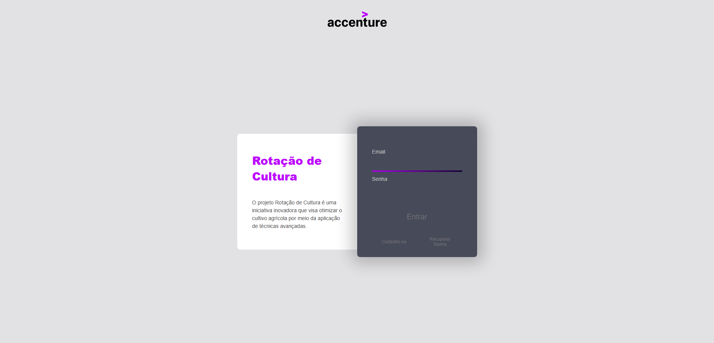
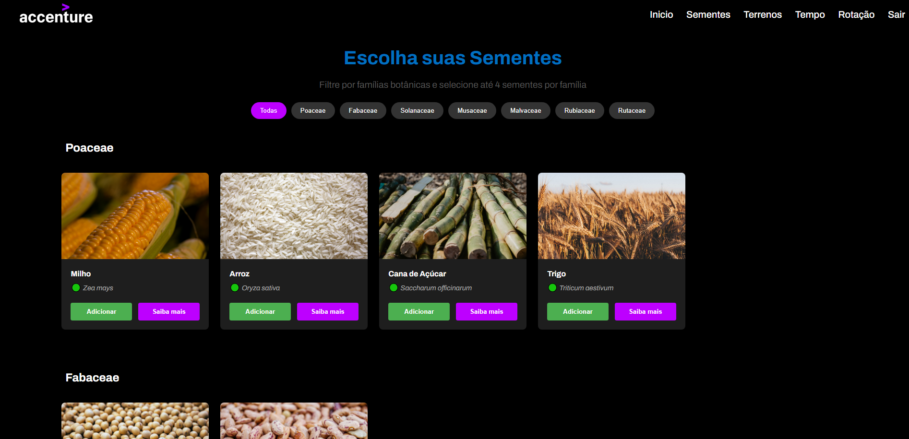
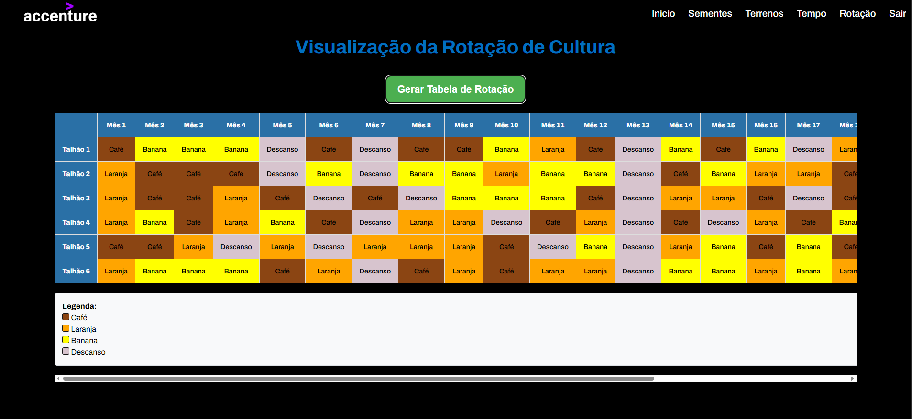
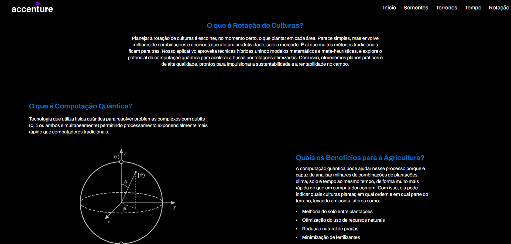
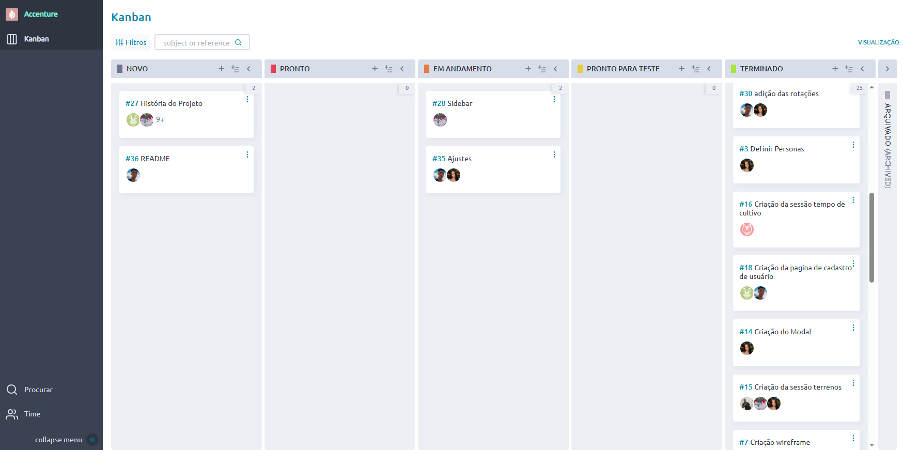

# 🌾 Projeto Rotação de Cultura

**Residência Tecnológica Porto Digital**  
Parceria entre a **Faculdade Senac Pernambuco** e a **Accenture**

---

## 🎯 Objetivo

Criar uma plataforma web interativa que apoia agricultores no **planejamento da rotação de culturas**, utilizando resultados gerados por **quantum annealing** (computação quântica).  
A solução busca **otimizar decisões agrícolas complexas**, promovendo **produtividade**, **preservação do solo** e **sustentabilidade**.

---

## 🧠 Contexto

O planejamento de rotação de culturas é um desafio estratégico que define, para cada talhão e período, as culturas ideais a serem plantadas.  
Com o aumento das possibilidades combinatórias, métodos tradicionais não são mais suficientes para gerar soluções em tempo hábil para a agricultura moderna.

É aí que entra a **computação quântica**: com sua capacidade de processar milhares de variáveis simultaneamente, conseguimos propor **planos agrícolas otimizados**, considerando clima, solo, demanda de mercado, entre outros fatores.

---

## 🌱 Por que a Agricultura?

A agricultura é muito mais que plantar e colher: ela é **cultura, tradição e inovação**.

- 🌾 Alimenta famílias  
- 👩‍🌾 Gera empregos  
- 🔄 Move a economia  
- 🌍 Sustenta o meio ambiente  

Valorizar a agricultura é reconhecer o esforço de quem transforma o solo em vida e garantir um futuro mais sustentável para todos.

---

## ⚛️ O que é Computação Quântica?

Tecnologia baseada na **física quântica**, onde bits tradicionais (0 e 1) são substituídos por **qubits**, que podem ser 0, 1 ou ambos ao mesmo tempo.  
Isso permite resolver problemas extremamente complexos **muito mais rápido** que computadores comuns.

---

## ✅ Benefícios para a Agricultura

- 🌾 Melhoria da fertilidade do solo entre safras  
- 🌱 Otimização do uso de água e insumos  
- 🐛 Redução natural de pragas  
- 🧪 Menor necessidade de fertilizantes químicos  
- 💰 Aumento da rentabilidade e sustentabilidade  

---

## 💻 Tecnologias Utilizadas

- HTML5  
- CSS3
- JavaScript  

---

## 🛠️ Como Trabalhar Neste Repositório

1. Clone o repositório:

```bash  
git clone https://github.com/seu-usuario/rotacao-de-cultura.git  
```

2. Crie uma nova branch com seu nome e o título da tarefa:

```bash  
git checkout -b seu_nome.titulo-da-branch  
```

3. Faça suas alterações, commit e push:

```bash  
git add .  
git commit -m "feat: adiciona header responsivo"  
git push origin sua-branch  
```

4. Crie uma Pull Request no GitHub e solicite a revisão de um colega.

---

## 📸 Demonstrações Visuais

Principais telas:

### Tela de Login:



### Sementes:



### Tela Responsiva:



### Saiba Mais:




---


## 📌 Status do Projeto

Acompanhe o andamento pelo nosso quadro no Trello:

🔗 [Ver Taiga](https://tree.taiga.io/project/gislany-accenture/kanban)

### 🖼️ Quadro Atual:



---

## 👥 Equipe de Desenvolvimento

| Integrante | Perfil |
|-----------|--------|
|  | **Gislany Araujo**<br>[@gislanysa](https://github.com/gislanysa) |
|  | **João Marcos Tavares**<br>[@jmtmds](https://github.com/jmtmds) |
|  | **Júlio César**<br>[@JulioCesarMartinsdaCunha](https://github.com/JulioCesarMartinsdaCunha) |
|  | **Guilherme Ramos**<br>[@guihrl](https://github.com/guihrl) |
|  | **Ian Lucas**<br>[@IanLucas12](https://github.com/IanLucas12) |
|  | **Ezequiel Borges**<br>[@kiellzz](https://github.com/kiellzz) |
